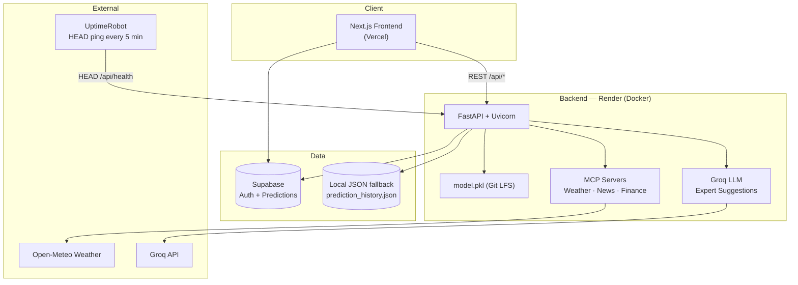
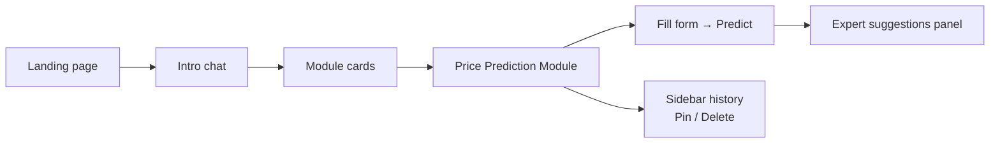
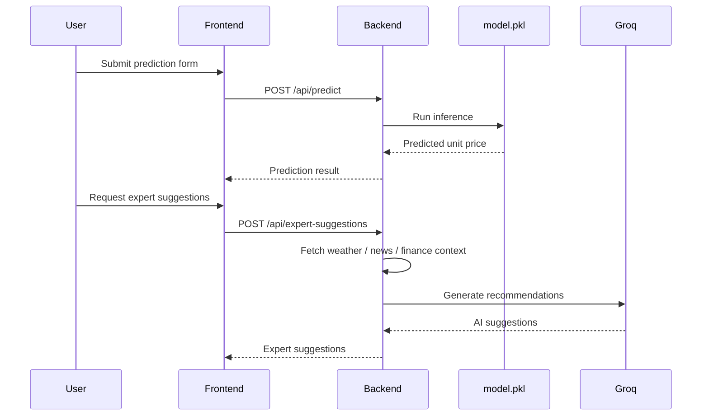

# Supply Chain Price Prediction

AI-powered supply chain unit price forecasting with live market context (weather, news, finance), Groq-based expert suggestions, and a modern Next.js dashboard.

---

## Live URLs

| Service | URL |
|---------|-----|
| **Frontend (Vercel)** | https://supply-chain-price-prediction.vercel.app |
| **Backend API (Render)** | https://supply-chain-price-prediction.onrender.com |
| **Health check** | https://supply-chain-price-prediction.onrender.com/api/health |
| **API docs (Swagger)** | https://supply-chain-price-prediction.onrender.com/docs |
| **GitHub** | https://github.com/Hkrish098/supply-chain-price-prediction |
| **Uptime monitor** | https://dashboard.uptimerobot.com (monitor: `/api/health`) |

---

## Architecture

### System overview



### User flow



### Prediction pipeline



---

## Tech stack

| Layer | Technology |
|-------|------------|
| Frontend | Next.js 16, React 19, TypeScript, Tailwind CSS 4, Framer Motion |
| Backend | FastAPI, Uvicorn, scikit-learn, XGBoost |
| Database | Supabase (auth + prediction history) |
| AI | Groq (`llama-3.3-70b-versatile`) |
| Deploy | Vercel (frontend), Render (backend Docker) |
| Model storage | Git LFS (~162 MB `model.pkl`) |
| Monitoring | UptimeRobot (keep-alive + uptime alerts) |

---

## Project structure

```
supply-chain-price-prediction/
├── frontend/                 # Next.js app (Vercel root: frontend/)
│   └── src/
│       ├── app/              # Pages, routes, auth callback
│       ├── components/       # UI, forms, sidebar, workspace
│       ├── services/         # API client (axios)
│       ├── lib/              # Supabase client
│       └── types/            # TypeScript interfaces
├── backend/                  # FastAPI app (Render root: backend/)
│   ├── app.py                # API endpoints
│   ├── ml/                   # train_model.py + model.pkl (LFS)
│   ├── mcp/                  # Weather, news, finance MCP servers
│   ├── services/             # Groq suggester, onboarding, market context
│   ├── scripts/              # Migrations, history utilities
│   └── Dockerfile
├── data/                     # Training CSV + prediction history JSON
├── .gitattributes            # Git LFS for backend/ml/*.pkl
└── README.md
```

---

## Prerequisites

- **Node.js** 18+ and npm
- **Python** 3.11+
- **Git** + **Git LFS**

```bash
brew install git-lfs
git lfs install
```

- Accounts (free tiers work): [GitHub](https://github.com), [Render](https://render.com), [Vercel](https://vercel.com), [Supabase](https://supabase.com), [Groq](https://console.groq.com) (optional, for AI suggestions)

---

## Local development

### 1. Clone the repository

```bash
git clone https://github.com/Hkrish098/supply-chain-price-prediction.git
cd supply-chain-price-prediction
git lfs pull
```

### 2. Backend setup

```bash
cd backend
python -m venv .venv
source .venv/bin/activate
pip install -r requirements.txt
```

Create `backend/.env` from the example and add your keys:

```bash
cp .env.example .env
```

Start the API server (port **8001** matches the frontend default):

```bash
uvicorn app:app --reload --port 8001
```

Verify the backend is healthy:

```bash
curl http://127.0.0.1:8001/api/health
```

Expected response:

```json
{"status":"healthy","model_loaded":true}
```

Interactive API docs: http://127.0.0.1:8001/docs

### 3. Frontend setup

Open a **new terminal**:

```bash
cd frontend
npm install
```

Create `frontend/.env.local`:

```env
NEXT_PUBLIC_API_URL=http://127.0.0.1:8001
NEXT_PUBLIC_SUPABASE_URL=your_supabase_url
NEXT_PUBLIC_SUPABASE_ANON_KEY=your_supabase_anon_key
```

Start the dev server:

```bash
npm run dev
```

Open the app: http://localhost:3000

### 4. Train the model (optional)

Only needed if `backend/ml/model.pkl` is missing after `git lfs pull`:

```bash
cd backend
python ml/train_model.py
```

---

## Environment variables

### Frontend (`frontend/.env.local`)

| Variable | Description |
|----------|-------------|
| `NEXT_PUBLIC_API_URL` | Backend URL. Local: `http://127.0.0.1:8001`. Production: Render URL |
| `NEXT_PUBLIC_SUPABASE_URL` | Supabase project URL |
| `NEXT_PUBLIC_SUPABASE_ANON_KEY` | Supabase anonymous (public) key |

### Backend (`backend/.env`)

| Variable | Description |
|----------|-------------|
| `GROQ_API_KEY` | Groq API key for expert suggestions |
| `SUPABASE_URL` | Supabase project URL |
| `SUPABASE_SERVICE_ROLE_KEY` | Supabase service role key (server-side only) |
| `NEWSAPI_KEY` | Optional — supply chain news headlines |
| `HOST` | Server host (default `0.0.0.0`) |
| `PORT` | Server port (Docker uses `5000`) |

> **Never commit** `.env` or `.env.local` files. They are listed in `.gitignore`.

---

## Deployment

### Backend — Render (Docker)

| Setting | Value |
|---------|--------|
| Repository | `Hkrish098/supply-chain-price-prediction` |
| Branch | `main` |
| **Root Directory** | `backend` |
| **Runtime** | Docker |
| **Dockerfile Path** | `Dockerfile` |

Add backend environment variables in the Render dashboard (`GROQ_API_KEY`, `SUPABASE_URL`, `SUPABASE_SERVICE_ROLE_KEY`, etc.).

**Model file:** `backend/ml/model.pkl` is tracked via **Git LFS**. Push LFS objects before deploying:

```bash
git lfs push --all origin
```

The Dockerfile validates that `model.pkl` is present and larger than 1 MB (rejects LFS pointer files).

**Health endpoint** supports both `GET` and `HEAD` (required for UptimeRobot free tier).

### Frontend — Vercel

| Setting | Value |
|---------|--------|
| Repository | `Hkrish098/supply-chain-price-prediction` |
| **Root Directory** | `frontend` |
| Framework | Next.js (auto-detected) |

Add these environment variables in the Vercel dashboard:

```env
NEXT_PUBLIC_API_URL=https://supply-chain-price-prediction.onrender.com
NEXT_PUBLIC_SUPABASE_URL=your_supabase_url
NEXT_PUBLIC_SUPABASE_ANON_KEY=your_supabase_anon_key
```

Redeploy after changing environment variables.

---

## Monitoring (UptimeRobot)

Render's **free tier** spins down after ~15 minutes of inactivity. A cold start can take 30–60 seconds. UptimeRobot pings the health endpoint every **5 minutes** to keep the service awake and alert you on downtime.

### Setup steps

1. Sign up at [https://uptimerobot.com](https://uptimerobot.com) (free tier).
2. Click **Add New Monitor**.
3. Monitor type: **HTTP(s)**.
4. Friendly name: `supply-chain-price-prediction.onrender.com/api/health`
5. URL:

```
https://supply-chain-price-prediction.onrender.com/api/health
```

6. Monitoring interval: **5 minutes**.
7. Configure alert contacts (email, Slack, etc.).
8. Save the monitor.

### Verify monitoring

Check HEAD support (UptimeRobot uses HEAD on free tier):

```bash
curl -I https://supply-chain-price-prediction.onrender.com/api/health
```

Expected: `HTTP/2 200`

Check full health response:

```bash
curl https://supply-chain-price-prediction.onrender.com/api/health
```

Expected:

```json
{"status":"healthy","model_loaded":true}
```

The UptimeRobot dashboard should show status **Up** (green).

---

## API endpoints

| Method | Endpoint | Description |
|--------|----------|-------------|
| `GET` / `HEAD` | `/api/health` | Health check (UptimeRobot uses HEAD) |
| `POST` | `/api/predict` | ML price prediction |
| `POST` | `/api/expert-suggestions` | AI expert suggestions (Groq + market context) |
| `POST` | `/api/onboarding` | Onboarding chat flow |
| `POST` | `/api/chat` | General chat |
| `POST` | `/api/insights` | Business insights |
| `GET` | `/api/weather` | Weather data (Open-Meteo) |
| `POST` | `/api/predictions` | Save a prediction |
| `GET` | `/api/predictions/history` | List prediction history |
| `DELETE` | `/api/predictions/history/{prediction_id}` | Delete one prediction |
| `DELETE` | `/api/predictions/history` | Clear all history |
| `GET` | `/api/stats` | Usage statistics |

---

## Git LFS (model file)

The trained model (~162 MB) is stored with Git LFS:

```bash
git lfs install
git lfs track "backend/ml/*.pkl"
git add .gitattributes
git lfs push --all origin
```

If Render build fails with **LFS 404** or `model.pkl missing or LFS pointer not pulled`, run `git lfs push --all origin` from your local machine and redeploy.

---

## Troubleshooting

| Issue | Fix |
|-------|-----|
| Frontend **Network Error** | Ensure backend is running. Set `NEXT_PUBLIC_API_URL` to `http://127.0.0.1:8001` locally |
| Render **LFS 404** on deploy | Run `git lfs push --all origin` |
| Render **COPY failed** / wrong paths | Set Render **Root Directory** to `backend` |
| UptimeRobot shows **405** | Health endpoint must support HEAD — see `app.py` `@app.api_route("/api/health", methods=["GET", "HEAD"])` |
| UptimeRobot shows **Down** | Wait for cold start (30–60s on free tier) or check Render deploy logs |
| `model_loaded: false` | Ensure `model.pkl` is in the Docker image (LFS pulled during clone) |
| Vercel TypeScript build error | Framer Motion `ease` arrays need `as const` in animation variants |
| Expert suggestions use fallback | Set `GROQ_API_KEY` in Render environment variables |
| Wrong GitHub repo deployed | Confirm remote: `git remote -v` should point to `Hkrish098/supply-chain-price-prediction` |

---

## Features

- Landing page with intro chat and module cards
- Price prediction module with ML pipeline (XGBoost / scikit-learn)
- Expert AI suggestions powered by Groq with weather, news, and finance context
- Sidebar recent predictions with **pin** and **delete**
- Supabase authentication and prediction history
- Glassmorphism UI with animated gradient mesh background
- Responsive dashboard layout

---

## Related docs

- [GROQ_INTEGRATION.md](./GROQ_INTEGRATION.md) — Groq + market context setup
- [frontend/DESIGN_GUIDE.md](./frontend/DESIGN_GUIDE.md) — UI design guidelines

---

## License

MIT
